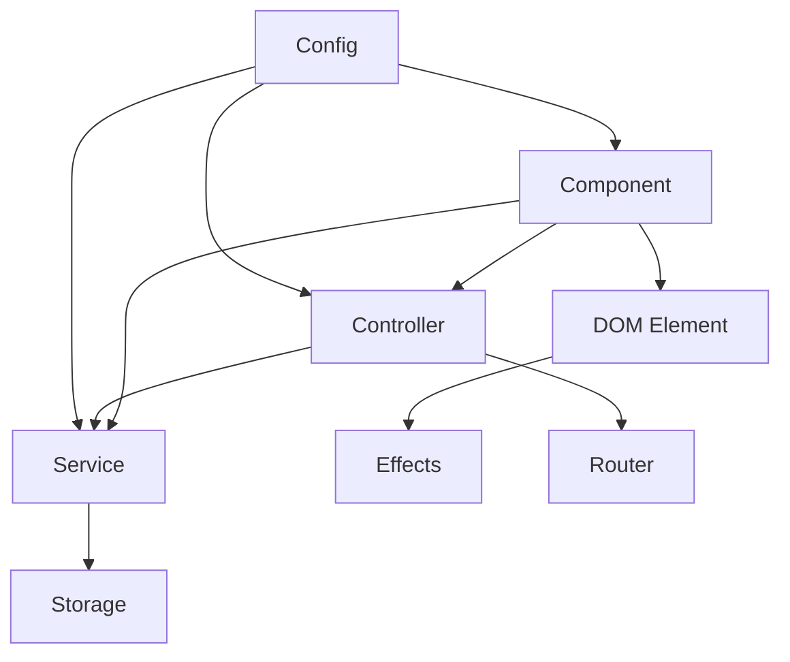
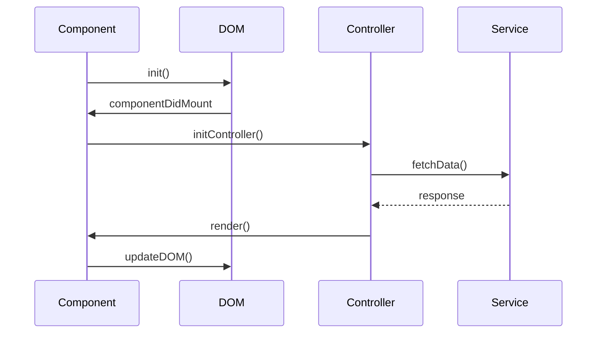
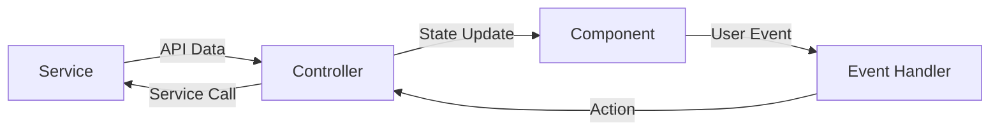

# QCObjects TypeScript Types Reference

This document provides a comprehensive overview of all TypeScript type definitions available in QCObjects.

## Core Components

### [Component Types](component.md)
Core building blocks for creating UI elements.
- `Component` - Base component class
- `ComponentConfig` - Component configuration
- `ComponentLifecycle` - Component lifecycle hooks
- `ComponentProps` - Component properties
- `ComponentState` - Component state management

### [Controller Types](controller.md)
Logic handlers for components.
- `Controller` - Base controller class
- `ControllerConfig` - Controller configuration
- `ControllerInstance` - Controller instance types
- `StandardResponse` - Standard response structure

### [Service Types](service.md)
Data and API interaction handlers.
- `Service` - Base service class
- `ServiceConfig` - Service configuration
- `ServiceResponse` - Service response types
- `ServiceData` - Service data structures

## DOM & UI

### [DOM Types](dom.md)
Browser DOM interaction types.
- `QCElement` - Extended DOM element interface
- `ShadowConfig` - Shadow DOM configuration
- `ElementConfig` - Element creation config
- `QCEventMap` - Custom event definitions

### [Effects Types](effects.md)
Animation and transition types.
- `EffectConfig` - Effect configuration
- `AnimationController` - Animation control
- `KeyframeConfig` - Animation keyframes
- `TransformConfig` - Transform effects

## Routing & Navigation

### [Router Types](router.md)
Application routing types.
- `RouteDefinition` - Route configuration
- `RouterConfig` - Router setup
- `NavigationGuard` - Navigation guards
- `RouteLocation` - Route information

## Data Management

### [Storage Types](storage.md)
Data persistence types.
- `StorageConfig` - Storage configuration
- `StorageDriver` - Storage implementations
- `StorageItem` - Stored item structure
- `StorageEvent` - Storage events

## Testing & Development

### [Testing Types](testing.md)
Testing utility types.
- `TestSuite` - Test suite structure
- `TestCase` - Individual test cases
- `MockFunction` - Function mocking
- `Matcher` - Assertion matchers

### [Configuration Types](config.md)
Application configuration types.
- `AppConfig` - Application config
- `EnvConfig` - Environment config
- `FeatureFlags` - Feature toggles
- `ConfigValidator` - Config validation

### [Utility Types](utils.md)
Helper and utility types.
- `Nullable<T>` - Nullable types
- `Optional<T>` - Optional properties
- `TypeGuard<T>` - Type guards
- `AsyncFunction<T>` - Async functions

## Type Relationships

### Core Architecture


### Component Lifecycle Flow


### Data Flow Architecture


## Common Patterns

### Component-Controller Pattern
```typescript
interface ComponentConfig {
  name: string;
  template?: string;
  controller?: typeof Controller;
}

class MyComponent extends Component {
  config: ComponentConfig = {
    name: 'my-component',
    controller: MyController
  };
}
```

### Service-Controller Pattern
```typescript
class MyController extends Controller {
  private service: MyService;
  
  async done(): Promise<void> {
    const data = await this.service.getData();
    this.component.render(data);
  }
}
```

### Router-Component Pattern
```typescript
const routes: RouteDefinition[] = [
  {
    path: '/',
    component: HomeComponent,
    controller: HomeController
  }
];
```

## Type Extension Points

### 1. Component Extension
```typescript
interface CustomComponent extends Component {
  customMethod(): void;
  customProperty: string;
}
```

### 2. Service Extension
```typescript
interface CustomService extends Service {
  customEndpoint(): Promise<unknown>;
}
```

### 3. Controller Extension
```typescript
interface CustomController extends Controller {
  customHandler(): void;
}
```

## Best Practices

### 1. Type Safety
- Always use strict type checking
- Avoid `any` types
- Use type guards for runtime checks
- Leverage generics for reusable code

### 2. Component Architecture
- Keep components focused and small
- Use proper type inheritance
- Implement lifecycle methods
- Handle component events properly

### 3. Service Pattern
- Use typed service responses
- Handle errors properly
- Implement caching when needed
- Use proper HTTP methods

### 4. Controller Logic
- Separate business logic
- Use proper error handling
- Implement proper state management
- Handle component communication

## Getting Started

1. Install TypeScript dependencies:
```bash
npm install typescript @types/qcobjects
```

2. Configure TypeScript:
```json
{
  "compilerOptions": {
    "target": "ES2022",
    "module": "NodeNext",
    "strict": true
  }
}
```

3. Import types:
```typescript
import { Component, Controller, Service } from 'qcobjects';
```

## Related Resources

- [QCObjects Documentation](https://docs.qcobjects.org/)
- [TypeScript Documentation](https://www.typescriptlang.org/)
- [Component Examples](../examples/components/)
- [Service Examples](../examples/services/)
- [Controller Examples](../examples/controllers/)

## Quick Start Guide

### 1. Project Setup
```bash
# Create new QCObjects project
npm create qcobjects-app my-app
cd my-app

# Install TypeScript dependencies
npm install typescript @types/qcobjects --save-dev

# Initialize TypeScript configuration
npx tsc --init
```

### 2. Basic Component
```typescript
// src/components/HelloWorld.ts
import { Component, ComponentConfig } from 'qcobjects';

interface HelloWorldProps {
  greeting: string;
}

export class HelloWorld extends Component {
  config: ComponentConfig = {
    name: 'hello-world',
    template: '<div>{{greeting}}</div>'
  };

  props: HelloWorldProps = {
    greeting: 'Hello, World!'
  };
}
```

### 3. Basic Service
```typescript
// src/services/DataService.ts
import { Service, ServiceConfig } from 'qcobjects';

export class DataService extends Service {
  config: ServiceConfig = {
    name: 'data-service',
    url: '/api/data'
  };

  async getData<T>(): Promise<T> {
    const response = await this.fetch();
    return response.json();
  }
}
```

### 4. Basic Controller
```typescript
// src/controllers/MainController.ts
import { Controller, ControllerConfig } from 'qcobjects';
import { DataService } from '../services/DataService';

export class MainController extends Controller {
  config: ControllerConfig = {
    component: {
      name: 'main-component'
    }
  };

  private service = new DataService();

  async done(): Promise<void> {
    const data = await this.service.getData();
    this.component.render(data);
  }
}
```

### 5. Running the App
```bash
# Build TypeScript files
npm run build

# Start development server
npm start
```

## Troubleshooting Guide

### Common Type Errors

#### 1. Component Property Type Mismatch
```typescript
// Error: Type '{ value: number }' is not assignable to type '{ value: string }'
interface Props {
  value: string;
}

class MyComponent extends Component {
  props: Props = {
    value: 42 // Error
  };
}

// Solution
interface Props {
  value: string | number;
}
```

#### 2. Controller Instance Type Error
```typescript
// Error: Property 'component' is undefined
class MyController extends Controller {
  done(): void {
    this.component.someMethod(); // Error
  }
}

// Solution
class MyController extends Controller {
  done(): void {
    if (!this.component) {
      throw new Error('Component not initialized');
    }
    this.component.someMethod();
  }
}
```

#### 3. Service Response Type Error
```typescript
// Error: Property 'data' does not exist on type 'unknown'
class MyService extends Service {
  async getData() {
    const response = await this.fetch();
    return response.data; // Error
  }
}

// Solution
interface ApiResponse {
  data: unknown;
}

class MyService extends Service {
  async getData<T>(): Promise<T> {
    const response = await this.fetch<ApiResponse>();
    return response.data as T;
  }
}
```

### Runtime Issues

#### 1. Component Not Rendering
```typescript
// Check component lifecycle
class MyComponent extends Component {
  async componentDidMount(): Promise<void> {
    console.log('Component mounted');
    // Add breakpoint here
  }

  async render(): Promise<void> {
    console.log('Rendering');
    // Add breakpoint here
  }
}
```

#### 2. Service Connection Issues
```typescript
// Add error handling and logging
class MyService extends Service {
  async fetch<T>(): Promise<T> {
    try {
      const response = await super.fetch<T>();
      return response;
    } catch (error) {
      console.error('Service error:', {
        url: this.config.url,
        error
      });
      throw error;
    }
  }
}
```

#### 3. Controller State Issues
```typescript
// Add state validation
class MyController extends Controller {
  validateState(): boolean {
    return (
      this.component !== undefined &&
      this.component.isInitialized &&
      this.component.isConnected
    );
  }

  async done(): Promise<void> {
    if (!this.validateState()) {
      throw new Error('Invalid controller state');
    }
    // Continue with logic
  }
}
```

### Development Tools

1. **TypeScript Compiler Options**
```json
{
  "compilerOptions": {
    "strict": true,
    "noImplicitAny": true,
    "strictNullChecks": true,
    "sourceMap": true,
    "declaration": true
  }
}
```

2. **VS Code Extensions**
- QCObjects Extension
- TypeScript Error Lens
- ESLint
- Prettier

3. **Debug Configuration**
```json
{
  "version": "0.2.0",
  "configurations": [
    {
      "type": "chrome",
      "request": "launch",
      "name": "Debug QCObjects",
      "url": "http://localhost:8080",
      "webRoot": "${workspaceFolder}/src",
      "sourceMapPathOverrides": {
        "webpack:///src/*": "${webRoot}/*"
      }
    }
  ]
}
``` 